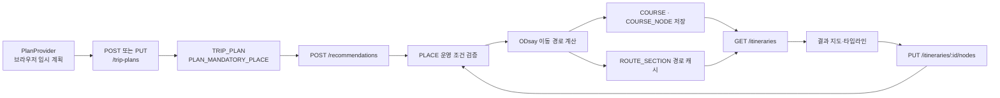

# ROUTA 여행 계획 · 추천 경로 구현 인수인계

> 작성일: 2026-08-10  
> 범위: 여행 조건 입력 → 장소·식사 선택 → 여행 계획 저장 → 추천 경로 계산 → 결과 조회·편집  
> 대상: 이 기능을 이어받아 개발하거나 다른 기능과 연결할 팀원

---

## 1. 이번 구현의 목표와 현재 동작

여행 계획 관련 화면이 Mock 데이터에만 의존하지 않도록, 실제 `PLACE`, `TRIP_PLAN`, `COURSE`, `COURSE_NODE`, `ROUTE_SECTION` 데이터를 사용하는 흐름을 만들었다.

현재 사용자는 아래 순서로 기능을 사용할 수 있다.

```text
여행 조건 입력
  → 관광지 선택
  → 점심·저녁 식사 방식/음식점 선택
  → TRIP_PLAN 저장
  → 추천 코스 3개 계산
  → 지도·타임라인 결과 조회
  → 체류 시간/순서/장소를 수정
  → 서버에서 실제 이동시간과 제약 조건으로 재계산·자동 저장
```

추천 결과는 다음 세 종류를 생성한다.

| `course_type` | 화면 이름 | 계산 기준 |
| --- | --- | --- |
| `SHORTEST_WALK` | 최소 도보 | ODsay 후보 중 도보 거리를 우선 |
| `FASTEST_TRANSIT` | 최소 시간 | 대중교통 이동 시간을 우선 |
| `BALANCED` | 추천 코스 | 시간 0.7, 거리 0.3 비율을 기본으로 환승·요금을 보정 |

---

## 2. 전체 데이터 흐름



### 저장 위치 원칙

| 정보 | 저장 위치 | 비고 |
| --- | --- | --- |
| 여행 기본 조건 | `TRIP_PLAN` | 날짜, 출발·도착, 반려동물 여부 등 |
| 선택한 관광지와 체류 시간 | `TRIP_PLAN.preferred_themes` JSON | 현재 스키마에 체류 시간 전용 컬럼이 없어 JSON에 보존 |
| 점심·저녁 설정 | `TRIP_PLAN.meal_preference` JSON | 지정/주변추천/제외 모드, 시간, 예약 여부 보존 |
| 필수 방문 장소 | `PLAN_MANDATORY_PLACE` | 현재는 장소 연결용, 고정 방문 시간 UI는 아직 미구현 |
| 추천 코스와 시간표 | `COURSE`, `COURSE_NODE` | 계산 성공 시에만 저장 |
| 실제 대중교통 후보·지도 그래픽 | `ROUTE_SECTION.path_details` | ODsay 응답을 JSON 문자열로 캐시 |

---

## 3. 프론트엔드 변경 사항

### 3.1 전역 여행 계획 상태

파일: [Client/src/app/providers/PlanProvider.jsx](../Client/src/app/providers/PlanProvider.jsx)

`PlanProvider`를 단순 배열이 아닌 여행 계획 전역 상태로 정리했다. 상태는 `sessionStorage`의 `routa:plan` 키에 저장되어 새로고침 후에도 같은 브라우저 탭에서 복원된다.

주요 상태는 다음과 같다.

```js
{
  tripPlanId,
  tripType, date, transport,
  startLocation, startLatitude, startLongitude, startTime,
  endLocation, endLatitude, endLongitude, endTime,
  themes, selectedPlaces,
  meals: { lunch, dinner },
  mealModes: { lunch, dinner },
  mealTimes: { lunch, dinner },
}
```

- `updatePlan()`은 객체 또는 함수형 갱신을 지원한다.
- `resetPlan()`은 새 여행 시작용 초기화 함수다.
- 식사 모드는 `DESIGNATED`, `NEARBY`, `SKIP` 중 하나다.
- 기본값은 점심 `DESIGNATED`, 저녁 `SKIP`이다. 기존처럼 음식점 한 곳만 골라도 진행할 수 있게 한 설정이다.

### 3.2 관광지·음식점 목록의 실제 DB 연결

관련 파일:

- [Client/src/features/place/place.api.js](../Client/src/features/place/place.api.js)
- [Client/src/features/restaurant/restaurant.api.js](../Client/src/features/restaurant/restaurant.api.js)
- [Client/src/pages/planner/PlanMealsPage.jsx](../Client/src/pages/planner/PlanMealsPage.jsx)

음식점 화면은 Mock 목록 대신 `GET /places?placeCategory=음식점`을 사용한다.

- 검색어, 페이지 번호, 페이지 크기 지원
- 반려동물 여행이면 `tripType=PET`을 전달해 가능 장소를 우선 조회
- 여행 날짜·출발지·여행 시간도 함께 전달
- 반려동물 정보는 요구사항대로 `가능` 또는 `불가능`만 화면에 표시한다. `REQUIRES_CONFIRMATION`, `UNKNOWN` 상태는 사용하지 않는다.
- 더 보기 방식 대신 이전/페이지 번호/다음 페이지 방식으로 변경했다.

> 목록 단계의 필터는 보조 기능이다. 최종 추천 시에는 실제 도착 시각을 기준으로 서버가 다시 검증한다.

### 3.3 식사 선택 화면: 세 가지 식사 방식

관련 파일:

- [Client/src/pages/planner/PlanMealsPage.jsx](../Client/src/pages/planner/PlanMealsPage.jsx)
- [Client/src/features/planner/components/MealSelector.jsx](../Client/src/features/planner/components/MealSelector.jsx)
- [Client/src/features/planner/components/MealSelector.module.css](../Client/src/features/planner/components/MealSelector.module.css)

점심과 저녁 각각 아래 방식을 선택할 수 있다.

| 모드 | 저장값 | 동작 |
| --- | --- | --- |
| 지정 음식점 | `DESIGNATED` | 사용자가 고른 음식점을 식사 노드로 넣음 |
| 주변 음식점 추천 | `NEARBY` | 추천 계산 중 현재/다음 장소 주변 음식점을 찾아 넣음 |
| 식사 제외 | `SKIP` | 해당 식사 노드를 경로에 넣지 않음 |

추가 규칙:

- 점심은 `11:00~14:00`, 저녁은 `17:00~20:00` 범위에서만 선택한다.
- 지정 음식점 모드인데 음식점을 선택하지 않으면 계획 저장 전에 안내한다.
- 주변 추천도 시간 범위는 선택해야 한다.
- `SKIP` 모드에서는 시간 검사를 하지 않는다.
- 모드를 주변 추천 또는 제외로 바꾸면 기존 지정 음식점은 자동 해제한다.

### 3.4 추천 로딩·결과 화면 실제 API 연결

관련 파일:

- [Client/src/pages/course/CourseLoadingPage.jsx](../Client/src/pages/course/CourseLoadingPage.jsx)
- [Client/src/pages/course/CourseResultPage.jsx](../Client/src/pages/course/CourseResultPage.jsx)
- [Client/src/features/course/course.api.js](../Client/src/features/course/course.api.js)
- [Client/src/shared/api/httpClient.js](../Client/src/shared/api/httpClient.js)

동작 순서:

1. 식사 화면의 `경로 확인` 버튼이 `POST /trip-plans` 또는 `PUT /trip-plans/:id`를 호출한다.
2. 성공한 `tripPlanId`로 로딩 화면에서 `POST /recommendations`를 호출한다.
3. 결과 화면은 `GET /itineraries?tripPlanId=...`로 코스 목록을 받고, 각 코스의 `GET /itineraries/:id` 상세를 조회한다.
4. URL의 `tripPlanId`, `itineraryId`를 사용해 새로고침 후에도 선택한 코스를 복원한다.

### 3.5 결과 화면의 실제 일정 편집

이전에는 체류 시간 변경, 삭제, 장소 추가, 순서 변경이 화면의 Mock 데이터만 바꿨다. 현재는 다음 API로 실제 재계산·저장한다.

```http
PUT /itineraries/:itineraryId/nodes
Content-Type: application/json

{
  "nodes": [
    { "placeId": 1, "nodeType": "VISIT", "stayMinutes": 90 },
    { "placeId": 2, "nodeType": "MEAL", "stayMinutes": 90 }
  ]
}
```

결과 화면에서 제공하는 편집 동작:

- 관광지·식사 체류 시간 30분 단위 변경
- 장소 삭제
- 실제 `PLACE` 검색 API를 이용한 장소 추가
- 드래그 앤 드롭 순서 변경
- `이 경로 다시 계산`

중요 사항:

- `START`, `END` 노드는 사용자 편집 요청에서 제외된다.
- 프론트가 임시 시간표를 만들지 않는다.
- 서버 재계산이 성공한 경우에만 최신 `COURSE_NODE`, 이동 구간, 지도 경로를 화면에 반영한다.
- 실패하면 이전 일정은 보존되고, 장소별 오류 사유가 화면에 표시된다.
- 상단 `일정 저장`은 현재 자동 저장 방식을 설명하는 확인 모달이다. 변경 자체는 편집 성공 시 이미 저장되어 있다.

### 3.6 지도에 실제 ODsay 이동 경로 표시

관련 파일:

- [Client/src/features/course/KakaoCourseMap.jsx](../Client/src/features/course/KakaoCourseMap.jsx)
- [Client/src/pages/course/CourseResultPage.jsx](../Client/src/pages/course/CourseResultPage.jsx)

지도는 단순히 장소 마커를 직선으로 연결하지 않는다.

- ODsay `loadLane`에서 받은 버스·지하철 좌표를 `geometrySegments`로 표시한다.
- 대중교통 후보가 없는 짧은 거리 구간은 도보 대체 경로로 처리한다.
- 과거 캐시 등으로 상세 좌표가 없으면 지도에서 보조 점선으로 표시한다.

---

## 4. 서버 변경 사항

### 4.1 장소 검색과 실제 장소 필터

관련 파일:

- [Server/src/modules/places/place.service.mjs](../Server/src/modules/places/place.service.mjs)
- [Server/src/modules/places/place.repository.mjs](../Server/src/modules/places/place.repository.mjs)
- [Server/src/providers/kakaoLocal.mjs](../Server/src/providers/kakaoLocal.mjs)

`GET /places`는 다음 조건을 지원한다.

- 검색어, 정확한 장소 분류(`placeCategory`)
- 반려동물 동반 여부
- 여행 날짜의 휴무일 제외
- 시작/종료 시간과 영업시간의 겹침 여부
- 출발지 반경 5km 내 후보
- 페이지네이션

주소 좌표가 없을 때 위치 검색은 카카오 Local API를 사용한다. 카카오 오류가 나면 `KAKAO_REST_API_KEY`와 Local API 권한을 확인해야 한다.

### 4.2 여행 계획 저장 구조

관련 파일:

- [Server/src/modules/trips/trip.service.mjs](../Server/src/modules/trips/trip.service.mjs)
- [Server/src/modules/trips/trip.repository.mjs](../Server/src/modules/trips/trip.repository.mjs)
- [Server/src/modules/trips/trip.controller.mjs](../Server/src/modules/trips/trip.controller.mjs)
- [Server/src/modules/trips/trip.router.mjs](../Server/src/modules/trips/trip.router.mjs)

여행 계획 저장 API:

```http
POST /trip-plans
PUT /trip-plans/:tripPlanId
GET /trip-plans/:tripPlanId
```

서버가 검증하는 항목:

- 출발 시간 < 종료 시간
- 날짜·시간 형식
- 위도·경도 형식
- 선택 장소·지정 음식점 ID 존재 여부
- 점심/저녁 시간 범위
- 식사 모드 값

식사 저장 예시는 다음과 같다.

```json
{
  "meals": [
    {
      "placeId": 1518081753,
      "mealSlot": "LUNCH",
      "scheduledTime": "12:00",
      "mode": "DESIGNATED",
      "isFixedReservation": false,
      "stayMinutes": 90
    },
    {
      "mealSlot": "DINNER",
      "scheduledTime": "19:00",
      "mode": "NEARBY",
      "stayMinutes": 90
    },
    {
      "mealSlot": "DINNER",
      "mode": "SKIP"
    }
  ]
}
```

> 실제 저장값은 슬롯별 하나만 가진다. 위 JSON은 각 모드의 형태를 설명하기 위한 예시다.

### 4.3 ODsay 이동 경로와 도보 대체

관련 파일:

- [Server/src/providers/odsay.mjs](../Server/src/providers/odsay.mjs)
- [Server/src/modules/recommendations/recommendation.service.mjs](../Server/src/modules/recommendations/recommendation.service.mjs)
- [Server/src/modules/recommendations/recommendation.scorer.mjs](../Server/src/modules/recommendations/recommendation.scorer.mjs)

ODsay 길찾기 처리 방식:

1. 장소 쌍마다 ODsay 대중교통 후보를 가져온다.
2. 코스 유형에 맞는 후보를 선택한다.
3. 선택한 ODsay 후보의 지도 그래픽을 추가 조회한다.
4. 후보 전체는 메모리와 `ROUTE_SECTION`에 캐시한다.
5. ODsay가 짧은 거리 등에 대해 대중교통 경로를 주지 않으면 도보 추정 경로를 사용한다.

환경 변수:

```env
ODSAY_API_KEY=ODsay_Server_Key
```

ODsay 오류가 날 때 확인할 항목:

- Browser 키가 아닌 **Server 키** 사용 여부
- ODsay 콘솔의 서버 IP 등록 여부
- API 사용 신청·승인 여부
- 출발/도착 좌표가 대한민국 범위인지

### 4.4 관광지·음식점 공통 제약 검증

관련 파일:

- [Server/src/utils/placeSchedule.mjs](../Server/src/utils/placeSchedule.mjs)
- [Server/src/utils/mealSchedule.mjs](../Server/src/utils/mealSchedule.mjs)
- [Server/src/modules/recommendations/recommendation.service.mjs](../Server/src/modules/recommendations/recommendation.service.mjs)

`evaluatePlaceVisit()`는 관광지와 음식점이 공통으로 사용하는 운영 조건 검사 함수다.

검사 항목:

- 여행 날짜의 휴무일
- 반려동물 동반 가능 여부
- 실제 도착 시각과 영업 시작 시간
- 체류 시간이 영업 종료 전 끝나는지
- 음식점의 라스트오더 이전에 식사를 시작하는지

식사 추가 제약:

- 점심 `11:00~14:00`
- 저녁 `17:00~20:00`
- 기본 체류 시간 90분
- 지정 예약 식사는 선택 시각 정확히 시작, 20분 전 도착
- 실제 대중교통 구간에는 일반 10분, 반려동물 여행 15분 여유 시간 추가

제약을 만족하지 못하면 경고만 표시하지 않고 `422` 오류를 반환한다.

```json
{
  "message": "선택한 일정은 운영 조건 또는 종료 시간 안에 배치할 수 없습니다.",
  "conflicts": [
    {
      "code": "CLOSING_TIME",
      "placeId": 123,
      "placeName": "예시 관광지",
      "message": "예시 관광지의 영업 종료 전까지 체류 시간을 확보할 수 없습니다."
    }
  ]
}
```

주요 오류 코드:

| 코드 | 의미 |
| --- | --- |
| `PET_NOT_ALLOWED` | 반려동물 동반 불가 장소 |
| `CLOSED_DAY` | 여행 날짜가 휴무일 |
| `CLOSING_TIME` | 체류 종료가 영업 종료 이후 |
| `LAST_ORDER` | 라스트오더 이후 식사 시작 |
| `MEAL_TIME_WINDOW` | 점심/저녁 권장 시간 창 충돌 |
| `RESERVATION_TIME` | 예약 시각·20분 전 도착 조건 충돌 |
| `END_TIME` | 여행 종료 시간 초과 |
| `NEARBY_MEAL_NOT_FOUND` | 1km 안에서 조건을 통과한 주변 식당을 찾지 못함 |

### 4.5 주변 음식점 추천 방식

`NEARBY` 식사는 계획 저장 때 특정 `placeId`를 갖지 않는다. 추천 계산 중에 정해진다.

1. 현재 장소와 다음 방문 후보를 기준점으로 정한다.
2. 두 기준점 반경 500m에서 음식점을 찾는다.
3. 없으면 반경을 1km로 확대한다.
4. 반려동물, 휴무일, 영업시간, 라스트오더를 통과한 후보만 남긴다.
5. 현재/다음 장소 중 가까운 거리와 평점을 기준으로 우선순위를 정한다.
6. 선택된 음식점은 `COURSE_NODE`의 `MEAL` 노드로 저장된다.

> 현재는 실제 ODsay 우회 시간 15분 제한까지는 적용하지 않는다. 이 부분은 후속 개선 항목이다.

### 4.6 일정 조회·수정 API

관련 파일:

- [Server/src/modules/itineraries/itinerary.router.mjs](../Server/src/modules/itineraries/itinerary.router.mjs)
- [Server/src/modules/itineraries/itinerary.controller.mjs](../Server/src/modules/itineraries/itinerary.controller.mjs)
- [Server/src/modules/itineraries/itinerary.service.mjs](../Server/src/modules/itineraries/itinerary.service.mjs)
- [Server/src/modules/itineraries/itinerary.repository.mjs](../Server/src/modules/itineraries/itinerary.repository.mjs)
- [Server/src/modules/recommendations/recommendation.repository.mjs](../Server/src/modules/recommendations/recommendation.repository.mjs)

| 메서드 | 경로 | 설명 |
| --- | --- | --- |
| `GET` | `/itineraries?tripPlanId=:id` | 계획의 추천 코스 카드 목록 조회 |
| `GET` | `/itineraries/:itineraryId` | 장소, 시간표, 이동 구간, 지도 좌표 포함 상세 조회 |
| `PUT` | `/itineraries/:itineraryId/nodes` | 편집 노드를 서버에서 재계산 후 저장 |

수정 API는 다음 순서로 동작한다.

1. 로그인 사용자 소유 코스인지 확인한다.
2. 요청의 `VISIT`, `MEAL` 노드 형식·체류 시간을 검증한다.
3. DB의 식사 설정을 다시 결합한다.
4. 사용자가 정한 순서를 유지한 채 ODsay 이동 시간과 모든 운영 제약을 계산한다.
5. 실패하면 DB를 수정하지 않고 `422`를 반환한다.
6. 성공하면 하나의 트랜잭션에서 해당 `COURSE` 요약과 `COURSE_NODE` 전체를 교체한다.
7. 최신 상세 일정과 지도 경로를 반환한다.

---

## 5. 실행 방법과 필수 환경 변수

### 서버

```bash
cd /Users/songjeong-geun/Desktop/Semi-Project/routa/Server
npm install
npm run dev
```

- 기본 API 주소: `http://localhost:18765`
- 문법 검사: `npm run check`

### 프론트엔드

```bash
cd /Users/songjeong-geun/Desktop/Semi-Project/routa/Client
npm install
npm run dev
```

- 기본 Vite 주소: `http://localhost:5173`
- API 주소는 `VITE_API_URL`로 변경 가능
- 프로덕션 빌드: `npm run build`

### 서버 환경 변수 예시

실제 값은 공유하지 말고 각자 `.env`에 설정한다.

```env
DATABASE_URL=Supabase_PostgreSQL_Connection_String
FRONTEND_URL=http://localhost:5173
KAKAO_REST_API_KEY=Kakao_REST_API_Key
ODSAY_API_KEY=ODsay_Server_Key
```

`FRONTEND_URL`은 현재 CORS 허용 주소다. Vite가 5174에서 실행되면 서버 허용 주소도 일치시켜야 한다.

---

## 6. 검증 완료 내역

다음 검증을 완료했다.

- 서버 문법 검사: `npm run check` 통과
- 프론트 프로덕션 빌드: `npm run build` 통과
- 실제 DB의 기존 여행 계획으로 추천 코스 3개 생성 성공
- 저장된 코스를 실제 노드 목록으로 재계산하고 지도용 이동 구간 반환 성공
- 체류 시간을 900분으로 변경하는 제약 위반 요청에서 `422 / CLOSING_TIME` 반환 확인
- 위 실패 요청 이후 기존 코스의 체류 시간이 변경되지 않았음을 확인

현재 프론트 lint에는 이 기능과 무관한 기존 오류 13개가 남아 있다.

- `Client/src/app/router/router.jsx`: 사용하지 않는 Profile import
- `Client/src/features/planner/components/ThemeSelector.jsx`: 미사용 import/props
- `Client/src/pages/home/HomePage.jsx`: 미사용 컴포넌트·함수
- `Client/src/pages/inquiry/MyInquiriesPage.jsx`: 정의되지 않은 `InquiryStats`

이번 문서에서 다룬 여행 계획·식사·결과 화면 파일에서는 새 lint 오류가 없다.

---

## 7. 아직 남은 중요 작업

### 우선순위 높음

1. **고정 방문 시간 구현**
   - `PLAN_MANDATORY_PLACE.fixed_visit_time`은 현재 항상 `NULL`이다.
   - 장소 선택 UI, 저장, 추천 계산, 결과 편집 제한까지 연결해야 한다.
   - 고정 장소는 지정 시각 전에 도착하고 정확히 방문을 시작하도록 계산해야 한다.

2. **실제 출발지·도착지 좌표 보존**
   - 현재 `COURSE_NODE`가 `PLACE` FK를 요구하므로 출발·도착 좌표와 가장 가까운 장소를 `START`/`END` 경계 노드로 사용한다.
   - 첫·마지막 이동 거리가 실제 사용자의 주소와 달라질 수 있다.
   - 스키마에 좌표형 경계 노드를 지원하거나 별도 시작/종료 노드 구조가 필요하다.

3. **주변 음식점의 실제 우회 시간 계산**
   - 현재는 반경, 운영 조건, 거리, 평점으로 후보를 고른다.
   - `이전 장소 → 음식점 → 다음 장소`와 직접 이동의 ODsay 시간을 비교해 15분 이하 우회를 우선하는 로직이 필요하다.

4. **ODsay 첫차·막차 검증**
   - 현재는 경로·시간·요금 계산 중심이다.
   - 여행 날짜와 출발 시각을 고려한 첫차·막차 제약은 별도 확인이 필요하다.

### 우선순위 중간

5. 장소를 직접 고르지 않고 테마만 선택했을 때 자동 후보 생성
6. 세 코스 중 하나가 불가능해도 가능한 나머지 코스를 표시하는 독립적 생성 처리
7. 저장 일정 목록 화면, 일정 이름, 대표 코스 확정 기능
8. 고정 방문·식사·운영시간·종료시간에 대한 자동 테스트 추가
9. 기존 프론트 lint 13개 정리

---

## 8. 개발 시 주의할 점

- `schema.sql`이 아니라 **Supabase 실제 스키마**를 기준으로 작업한다.
- `TRIP_PLAN.meal_preference`, `preferred_themes`는 현재 JSON 문자열이다. 파싱 실패 시 서버는 빈 설정으로 안전 처리한다.
- 일정 수정 시 프론트에서 시간을 계산하지 않는다. 서버 응답의 `arrivalTime`, `departureTime`, `legs`를 항상 신뢰한다.
- `COURSE_NODE`를 직접 수정하는 코드는 반드시 트랜잭션으로 `COURSE` 요약과 함께 바꿔야 한다.
- ODsay 키는 프론트에 노출하면 안 된다. 서버 환경 변수에서만 사용한다.
- `NEARBY` 식사는 계획 저장 시 음식점 ID가 없고 추천 결과의 `COURSE_NODE`에만 실제 음식점 ID가 저장된다.

