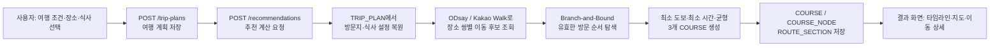
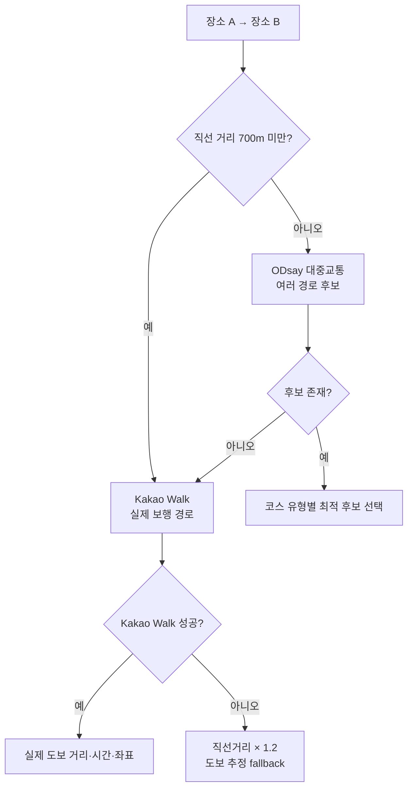

# ROUTA 경로 추천 알고리즘 발표 가이드

> 대상 코드 기준: `Server/src/modules/recommendations/recommendation.service.mjs`  
> 핵심 한 문장: **ROUTA는 사용자가 고른 방문지와 식사 시간 제약을 만족하는 순서를 Branch-and-Bound로 탐색하고, 각 이동 구간에는 실제 대중교통·도보 길찾기 결과를 사용해 세 종류의 코스를 만든다.**

---

## 1. 발표에서 먼저 말할 결론

다음 문장으로 시작하면 프로젝트의 차별점과 알고리즘의 역할이 자연스럽게 전달된다.

> "단순히 가까운 장소를 이어 붙이지 않았습니다. 점심·저녁 시간, 영업시간, 휴무일, 반려동물 동반 가능 여부, 여행 종료 시각을 모두 제약 조건으로 두고, 가능한 방문 순서를 비교해 목적별 최적 코스를 추천합니다."

그 뒤에 다음 세 가지를 순서대로 설명한다.

1. **무엇을 입력받는가**: 여행 시간, 선택 장소 최대 5개, 점심·저녁 최대 2개, 선택적 출발·도착 위치
2. **무엇을 최적화하는가**: 최소 도보 / 최소 이동 시간 / 균형 추천
3. **어떻게 보장하는가**: 시간·영업 제약을 만족하지 않는 경우는 탐색 중 즉시 제외하고, 남은 후보만 Branch-and-Bound로 비교한다.

## 2. 전체 처리 흐름



### 화면과 서버 파일의 연결

| 단계 | 주요 파일 | 하는 일 |
| --- | --- | --- |
| 추천 요청 | `Client/src/pages/course/CourseLoadingPage.jsx` | 저장된 `tripPlanId`로 추천 API를 호출하고 결과 화면으로 이동 |
| 추천 API | `Server/src/modules/recommendations/recommendation.controller.mjs` | 로그인 사용자와 여행 계획 ID를 서비스에 전달 |
| 핵심 알고리즘 | `Server/src/modules/recommendations/recommendation.service.mjs` | 제약 검사, 경로 조회, Branch-and-Bound 탐색 |
| 대중교통·도보 | `Server/src/providers/odsay.mjs`, `Server/src/providers/kakaoWalk.mjs` | 실제 이동 시간·거리·환승·좌표를 공통 형식으로 변환 |
| 경로 선택 기준 | `Server/src/modules/recommendations/recommendation.scorer.mjs` | 세 코스의 비교 기준을 정의 |
| 결과 저장 | `Server/src/modules/recommendations/recommendation.repository.mjs` | `COURSE`, `COURSE_NODE`, `ROUTE_SECTION`에 저장 |
| 지도 표시 | `Client/src/features/course/KakaoCourseMap.jsx` | 실제 노선 좌표 또는 추정 점선을 지도에 그림 |

## 3. 입력 제한을 둔 이유

알고리즘은 방문 순서를 비교하므로, 장소 수가 늘수록 경우의 수가 급격히 커진다.

- 방문 장소(관광지·카페): 최대 **5개**
- 식사: 점심·저녁 최대 **2개**
- 최대 정류장: **7개**

정류장 7개를 제약 없이 모두 순열로 배치하면 `7! = 5,040`가지다. ROUTA는 점심이 저녁보다 앞서야 한다는 순서 제약을 두므로, 두 식사를 포함한 경우의 수는 대략 절반인 `7! / 2 = 2,520`가지까지 줄어든다. 여기에 시간·영업 조건을 통과하지 못하는 가지를 일찍 제거한다.

```js
// Server/src/modules/recommendations/recommendation.service.mjs
const MAX_VISIT_STOPS = 5

if (selectedPlaces.length > MAX_VISIT_STOPS) {
  throw createHttpError(`필수 방문 장소는 최대 ${MAX_VISIT_STOPS}곳까지 선택할 수 있습니다.`)
}
```

발표 멘트:

> "일반적인 TSP처럼 장소 수가 커지면 완전 탐색이 어려워집니다. 하지만 서비스 기획에서 최대 7개로 제한했기 때문에, 시간 제약을 포함한 완전 탐색이 현실적인 응답 시간 안에 가능하도록 설계했습니다."

## 4. 추천에 사용하는 제약 조건

### 4.1 식사 제약

| 식사 | 시작 가능 시간 | 기본 체류 시간 |
| --- | --- | --- |
| 점심 | 11:00 ~ 14:00 | 60분 |
| 저녁 | 17:00 ~ 20:00 | 60분 |

식당 예약이 고정된 경우에는 예약 시각보다 20분 전에 도착해야 한다. 식사 시작 전까지 기다려야 하면 대기 시간을 기록하고, 점수에도 반영한다.

```js
// recommendation.service.mjs - 식사 도착 시각 판정의 핵심
const visitStart = meal.isFixedReservation
  ? maxDate(travelArrivalTime, constraint.preferredStart, constraint.earliestStart)
  : maxDate(travelArrivalTime, constraint.earliestStart)

const reservationOnTime = !constraint.reservationArrivalDeadline
  || travelArrivalTime <= constraint.reservationArrivalDeadline
const withinLatestStart = !constraint.latestStart || visitStart <= constraint.latestStart
```

### 4.2 장소 제약

`evaluatePlaceVisit`는 관광지·지정 음식점·자동 추천 음식점에 공통으로 적용된다.

- 반려동물 여행이면 `pet_is_allowed = true`만 통과
- 여행 날짜의 휴무일 제외
- 영업 시작 전이면 기다린 뒤 방문 시작
- 체류 시간이 영업 종료를 넘으면 제외
- 음식점은 라스트오더 이후면 제외
- 마지막 노드가 종료 시간보다 늦으면 제외

```js
// Server/src/utils/placeSchedule.mjs
if (plan.withPet && place.petIsAllowed !== true) conflicts.push(...)
if (hasClosedDay(place, arrivalTime)) conflicts.push(...)
if (closingTime && departureTime > closingTime) conflicts.push(...)
if (enforceLastOrder && lastOrderTime && visitStart > lastOrderTime) conflicts.push(...)
```

발표 멘트:

> "이동 거리만 짧은 경로가 아니라, 실제 방문할 수 있는 경로만 후보로 남깁니다. 따라서 불가능한 경로를 결과에서 나중에 경고하는 것이 아니라 계산 과정에서 제거합니다."

## 5. 이동 시간과 거리: 실제 API + 안전한 fallback

### 5.1 한 장소 쌍을 계산하는 우선순위



- 가까운 두 장소는 대중교통보다 도보가 자연스러우므로 700m 미만에서 Kakao Walk를 우선 사용한다.
- 700m 이상은 ODsay에서 대중교통 후보를 받는다.
- ODsay에 경로가 없거나 `-98` 근거리 오류를 반환하면 Kakao Walk로 전환한다.
- Kakao Walk까지 이용할 수 없을 때만 직선거리 기반 추정을 쓴다. 결과에는 `WALK_FALLBACK` 경고가 남는다.

```js
// Server/src/providers/odsay.mjs
if (calculateDistanceMeters(from, to) < 700) {
  return [await createWalkingRouteOrFallback(from, to)]
}

if (alternatives.length === 0) {
  return [await createWalkingRouteOrFallback(from, to)]
}
```

### 5.2 코스별로 같은 이동 후보를 다르게 선택하는 기준

| 코스 | 1순위 | 동률일 때 |
| --- | --- | --- |
| `SHORTEST_WALK` | 도보 거리 | 이동 시간 → 환승 수 |
| `FASTEST_TRANSIT` | 이동 시간 | 환승 수 → 도보 거리 |
| `BALANCED` | 시간·도보·환승·요금의 가중 합 | 이동 시간 |

```js
// Server/src/modules/recommendations/recommendation.scorer.mjs
if (courseType === "SHORTEST_WALK") {
  return first.walkingDistanceMeters - second.walkingDistanceMeters
    || first.durationMinutes - second.durationMinutes
}

if (courseType === "FASTEST_TRANSIT") {
  return first.durationMinutes - second.durationMinutes
    || first.transferCount - second.transferCount
}

const balancedScore = route.durationMinutes
  + (route.walkingDistanceMeters / 1000) * 8
  + route.transferCount * 8
  + route.estimatedFare / 500
```

## 6. Branch-and-Bound 핵심 설명

### 6.1 탐색 상태(state)

각 탐색 가지는 단순한 장소 배열이 아니라 다음 정보를 같이 가진다.

```js
{
  currentPlace,       // 마지막으로 방문한 장소
  currentTime,        // 그 장소에서 출발 가능한 시각
  nodes,              // 지금까지 확정된 일정 항목
  summary,            // 이동 시간·도보·환승·요금 합계
  warnings,           // 식사 대기, fallback 등의 안내
  idleMinutes,        // 영업 시작·식사 시간까지 기다린 시간
  usedMealPlaceIds,   // 점심·저녁 중복 방지용 음식점 ID
}
```

### 6.2 다음 후보를 만드는 방식

방문지가 3개 남아 있으면 각 방문지를 다음 후보로 만든다. 식사는 시간 순서가 중요하므로 아직 배치하지 않은 식사 중 **가장 이른 식사 하나만** 후보에 넣는다.

```js
const candidates = remainingVisits.map((visit) => ({
  stop: visit,
  remainingVisits: remainingVisits.filter((candidate) => candidate.placeId !== visit.placeId),
  remainingMeals,
}))

if (remainingMeals[0]) {
  candidates.push({
    stop: remainingMeals[0],
    remainingVisits,
    remainingMeals: remainingMeals.slice(1),
  })
}
```

따라서 점심과 저녁의 순서가 뒤바뀌는 불필요한 탐색을 시작부터 하지 않는다.

### 6.3 가지를 확장하는 과정

후보 하나를 추가할 때 다음 순서로 계산한다.

1. 현재 장소에서 후보 장소까지의 실제 이동 경로를 선택한다.
2. 대중교통이면 일반 여행 10분, 반려동물 여행 15분의 여유 시간을 일정 시각에 더한다.
3. 후보가 식사이면 식사 시간 창·예약 시각을 검사한다.
4. 장소 공통 제약(휴무·영업시간·반려동물·라스트오더)을 검사한다.
5. 종료 시간을 넘으면 이 가지를 중단한다.
6. 통과하면 노드와 누적 이동 수치를 새 state에 추가한다.

```js
// recommendation.service.mjs - 제약을 통과하지 못하면 null을 반환
const placeTiming = evaluatePlaceVisit({
  plan,
  place: stop,
  travelArrivalTime,
  stayMinutes: stop.stayMinutes,
  requestedStart: stop.nodeType === "MEAL" ? visitStart : null,
  enforceLastOrder: stop.nodeType === "MEAL",
})
if (!placeTiming.isFeasible) return null

if (departureTime > new Date(plan.endTime)) return null
```

### 6.4 Bound(하한)으로 가지를 자르는 방식

현재 구현의 하한은 **이미 발생한 비용(cost so far)** 이다. 앞으로 추가되는 이동 시간·도보 거리·환승·요금·대기 시간은 모두 음수가 될 수 없으므로, 현재 비용은 최종 비용보다 작거나 같다.

```js
const currentScore = getCourseScore(state, courseType)

if (currentScore >= bestScore) {
  searchStats.prunedByBound += 1
  return
}
```

이미 찾은 최적 코스의 점수가 `bestScore`이고, 현재까지 누적 비용이 그보다 크거나 같으면 앞으로 아무리 잘 이어도 이길 수 없다. 따라서 그 아래 경우의 수는 탐색하지 않는다.

> 이 구현은 "남은 모든 장소까지의 최소 비용"까지 계산하는 복잡한 하한이 아니라, **정확하지만 보수적인 하한**을 사용한다. 장소 수를 7개로 제한했기 때문에 정확성과 구현 안정성을 우선한 선택이다.

### 6.5 완료한 경로의 비교

남은 방문지와 식사가 없으면 선택적 도착지까지 연결한다. 제약을 만족하면 현재 최고 점수와 비교해 최적 상태를 교체한다.

```js
if (remainingVisits.length === 0 && remainingMeals.length === 0) {
  const completedState = endPlace
    ? await createSearchTransition({ state, stop: { ...endPlace, nodeType: "END", stayMinutes: 0 }, ... })
    : state

  if (completedScore < bestScore) {
    bestState = completedState
    bestScore = completedScore
  }
}
```

## 7. 코스별 최적화 점수

`getCourseScore`는 탐색 중 어느 경로가 더 좋은지를 판단하는 함수다.

| 코스 | 점수의 핵심 의미 |
| --- | --- |
| 최소 도보 | 도보 거리의 비중을 매우 크게 두고, 그 다음 이동 시간·대기를 비교 |
| 최소 시간 | 이동 시간의 비중을 매우 크게 두고, 환승·도보·대기를 보조로 비교 |
| 균형 추천 | 시간, 도보, 환승, 요금, 대기를 적당히 합산 |

```js
if (courseType === "SHORTEST_WALK") {
  return walkingDistanceMeters * 1_000 + totalMinutes + idleMinutes * 10
}

if (courseType === "FASTEST_TRANSIT") {
  return totalMinutes * 1_000
    + transferCount * 10
    + walkingDistanceMeters / 1_000
    + idleMinutes * 100
}

return totalMinutes * 0.7
  + (walkingDistanceMeters / 1000) * 0.3
  + transferCount * 8
  + estimatedFare / 500
  + idleMinutes * 0.5
```

발표에서 "가중치가 임의적인 것 아닌가요?"라는 질문을 받으면 다음처럼 답한다.

> "가중치는 목적별 우선순위를 명시하기 위한 정책 값입니다. 최소 도보와 최소 시간은 1순위 지표가 분명하므로 큰 가중치로 우선순위를 고정했고, 균형 코스는 여러 불편 요소를 함께 고려하도록 가중 합을 사용했습니다. 이후 사용자 선택 로그가 쌓이면 이 값은 A/B 테스트나 설문 결과를 바탕으로 조정할 수 있습니다."

## 8. 자동 주변 음식점 추천의 동작과 한계

`NEARBY` 모드에서는 현재 장소와 다음 방문 후보 주변을 반경 500m에서 먼저 찾고, 없으면 1km까지 넓힌다. 이미 점심 또는 저녁으로 사용한 음식점은 SQL 조회 전부터 제외한다.

```js
for (const radiusKm of [0.5, 1]) {
  const candidates = await recommendationRepository.findNearbyRestaurants({
    latitude: anchor.latitude,
    longitude: anchor.longitude,
    radiusKm,
    withPet: plan.withPet,
    excludePlaceIds: [...usedMealPlaceIds],
  })
}
```

이때 후보는 가까운 순서, 평점 순서로 정렬해 첫 번째 음식점을 선택한다. 따라서 발표에서는 아래처럼 정확히 표현한다.

> "사용자가 고른 방문지와 식사 슬롯의 **순서**는 Branch-and-Bound로 탐색합니다. 다만 자동 주변 음식점은 API·DB 호출량을 제어하기 위해 각 상태에서 가장 적합한 한 곳을 휴리스틱으로 선택합니다."

모든 음식점 후보까지 전부 순열에 포함하는 것은 현재 구현 범위가 아니다. 그렇게 하면 탐색 공간과 길찾기 API 호출량이 크게 늘어난다.

## 9. 캐싱과 DB 저장을 설명하는 방법

### 서버 메모리 캐시

`routeCache.mjs`는 동일한 출발·도착 좌표 요청을 재사용한다.

| 데이터 | TTL | 목적 |
| --- | --- | --- |
| ODsay 대중교통 경로 | 15분 | Branch-and-Bound의 반복 호출과 실시간성 균형 |
| ODsay 노선 그래픽 | 1시간 | 지도 선 좌표 재사용 |
| Kakao 실제 도보 경로 | 6시간 | 무료 호출량 절감 |

동일 요청이 동시에 여러 번 들어와도 `pendingRouteRequests`가 하나의 Promise를 공유하므로, 외부 API를 한 번만 호출한다.

```js
const pendingRequest = pendingRouteRequests.get(key)
if (pendingRequest) return clone(await pendingRequest)
```

### DB 저장

- `COURSE`: 코스별 요약 수치와 경고
- `COURSE_NODE`: 방문 순서·도착/출발 시각·체류 시간
- `ROUTE_SECTION`: 장소 쌍별 이동 후보와 지도용 좌표

저장한 일정은 `saved_snapshot_json`으로 당시의 타임라인과 지도 데이터를 보존한다. 이후 새 추천이 생성되어도 사용자가 확정한 일정은 사라지지 않는다.

## 10. 지도에 실제 경로를 그리는 과정

1. ODsay 대중교통 후보에서 `mapObj`를 받는다.
2. `loadLane`으로 버스·지하철 노선 좌표를 가져와 `geometrySegments`로 변환한다.
3. Kakao Walk는 보행 안내 단계의 좌표를 `geometrySegments`로 변환한다.
4. 프론트 `KakaoCourseMap`은 지하철·버스·도보를 색이 다른 Polyline으로 그린다.
5. 실제 좌표가 없는 fallback 구간만 회색 점선으로 그린다.

발표 멘트:

> "지도에서 모든 선을 실제 경로처럼 표현하지 않았습니다. 실제 대중교통·보행 좌표가 있는 구간만 실선으로 그리고, API fallback으로 계산한 구간은 점선으로 구분해 데이터의 신뢰 수준을 사용자에게 투명하게 보여 줍니다."

## 11. 2~3분 발표 대본 예시

> "ROUTA의 핵심은 사용자가 고른 여러 장소를 단순히 가까운 순서로 정렬하지 않는 것입니다. 먼저 여행 날짜와 시작·종료 시간, 방문 장소 최대 5개, 점심·저녁 정보를 계획으로 저장합니다. 식사는 점심 11시부터 14시, 저녁 17시부터 20시라는 시간 창과 기본 60분 체류 시간을 적용합니다."

> "추천 요청이 오면 서버는 각 장소 사이의 이동 후보를 조회합니다. 가까운 구간은 카카오 실제 도보 경로를 사용하고, 그 외 구간은 ODsay에서 대중교통 후보를 받습니다. 최소 도보 코스는 도보 거리를, 최소 시간 코스는 이동 시간을 우선해 후보를 고릅니다."

> "그 다음 Branch-and-Bound로 방문 순서를 탐색합니다. 각 가지에는 현재 위치, 현재 시각, 누적 이동 시간·도보 거리·환승 수, 대기 시간을 저장합니다. 어떤 장소를 다음에 넣었을 때 휴무일, 영업 종료, 반려동물 제한, 식사 시간, 종료 시간을 어기면 그 가지는 즉시 제거합니다. 또 이미 누적된 점수가 현재 최적 점수보다 크면 이후 계산 없이 잘라냅니다."

> "장소와 식사를 모두 배치한 경로 중 점수가 가장 작은 결과를 선택하고, 최소 도보·최소 시간·균형 추천 세 가지를 저장합니다. 결과 화면에서는 실제 노선 좌표가 있으면 지도에 실선으로 그리고, fallback 결과는 점선으로 구분합니다."

## 12. 예상 질문과 답변

### Q. 왜 다익스트라나 플로이드 워셜이 아닌가요?

다익스트라는 한 출발점에서 각 목적지까지의 최단 경로 문제에 적합하다. ROUTA의 문제는 **여러 장소를 어떤 순서로 방문할지**와 **식사·영업시간 같은 시간 창을 만족할지**를 동시에 정하는 TSP with Time Windows 성격의 문제다. 그래서 순서를 탐색하고 제약으로 가지를 줄이는 Branch-and-Bound가 더 적합하다.

### Q. 정말 최적 경로를 찾나요?

사용자가 지정한 방문지·지정 식당의 순서에 대해서는 현재 점수 함수 기준으로 유효한 순서를 탐색하고, 더 나쁠 수밖에 없는 가지를 제거한다. 단, **자동 주변 음식점 모드**는 각 상태에서 대표 후보 한 곳을 휴리스틱으로 고르므로 모든 음식점 후보까지 포함한 전역 최적화는 아니다.

### Q. 외부 API가 실패하면 서비스 전체가 멈추나요?

아니다. 대중교통 경로가 없는 경우는 Kakao Walk로 전환하고, Kakao Walk까지 실패한 경우에만 직선거리 기반 도보 추정을 사용한다. 단, API 키·등록 IP 오류처럼 설정 오류는 숨기지 않고 명확한 오류를 반환한다.

### Q. API 호출이 너무 많아지지 않나요?

동일 장소 쌍의 후보는 한 추천 요청 안에서 `Map`으로 공유하고, 서버 메모리 캐시와 동시 요청 Promise 공유를 추가해 같은 외부 호출을 반복하지 않는다.

## 13. 발표 전에 확인할 시연 시나리오

1. 방문지 3개, 점심 지정, 저녁 주변 추천으로 정상 코스 3개를 생성한다.
2. 점심을 14시 이후에 시작해야 하는 조건 또는 영업 종료 이후 도착 조건을 만들어 422 제약 오류를 보여 준다.
3. 반려동물 여행에서 불가능한 장소를 선택해 제약 오류를 확인한다.
4. 결과 지도에서 실제 도보·버스·지하철 선과 점선 fallback 범례를 보여 준다.
5. 결과 경고의 `최적 경로 탐색: N개 가지 검토, M개 가지 제외` 문구로 실제 탐색이 동작했음을 보여 준다.

## 14. 현재 구현의 한계와 다음 개선 방향

발표에서 숨길 필요는 없지만, 질문이 나오면 아래처럼 설명한다.

1. **출발·도착 좌표의 정확도**: 현재 `COURSE_NODE.place_id`가 필수인 스키마 때문에, 사용자가 입력한 출발·도착 좌표는 가장 가까운 `PLACE`를 START/END 경계 노드로 사용한다. 다음 단계에서는 경계 좌표를 별도 컬럼 또는 별도 노드 모델로 저장하면 첫·마지막 구간을 더 정확히 계산할 수 있다.
2. **자동 주변 식당 후보**: 현재는 상태별 대표 음식점 한 곳을 골라 탐색한다. 품질을 높이려면 상위 2~3개 음식점까지 후보 분기를 늘리되, API 호출 제한을 고려해야 한다.
3. **하한의 강화**: 현재 하한은 누적 비용이다. 남은 장소 각각에 대한 최소 연결 비용을 더한 하한을 만들면 더 많은 가지를 제거할 수 있다.
4. **대중교통 여유 시간 표시**: 일정 배치에는 10분/15분 여유 시간을 반영하지만, 현재 요약 이동 시간은 API 이동 시간 위주다. 사용자에게 보여 주는 총 소요 시간에 여유 시간을 별도로 표기하면 더 명확하다.
5. **자동화 테스트**: 시간 창, 휴무일, 중복 식당, fallback, Branch-and-Bound 최적 순서에 대한 단위·통합 테스트를 추가하면 알고리즘 변경 시 신뢰도가 높아진다.
